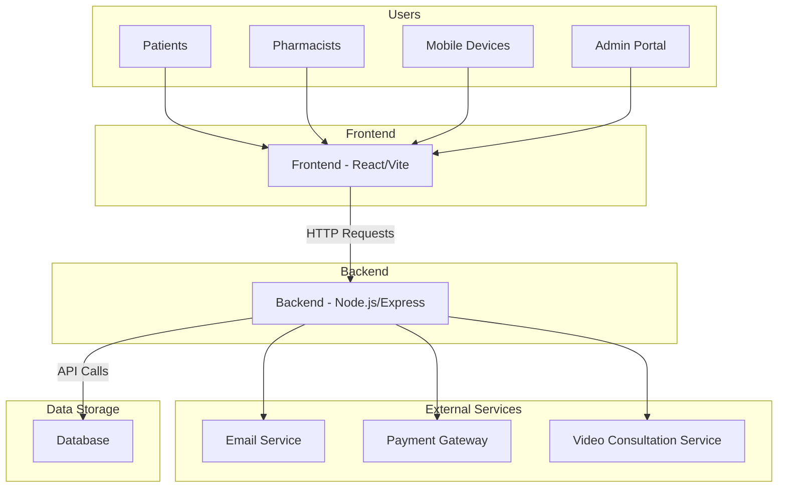

# TelePharmacy Application Architecture

## Component Description

### Frontend (React/Vite)
- User interface for patients and pharmacists
- Responsive design for desktop and mobile
- Real-time updates through WebSocket connections
- Form validation and error handling

### Backend (Node.js/Express)
- RESTful API for all application functionality
- User authentication and authorization
- Business logic implementation
- Integration with external services
- Data validation and sanitization

### Database
- Patient records storage
- Prescription management
- Medication inventory
- Consultation history
- Pharmacist profiles

### External Services
- Email service for notifications and prescriptions
- Payment gateway for processing payments
- Video consultation service for remote meetings

### Users
- Patients: Can view prescriptions, schedule consultations, request refills
- Pharmacists: Can review prescriptions, conduct consultations, manage inventory
- Mobile users: Access to mobile-optimized interface
- Admins: System management and oversight