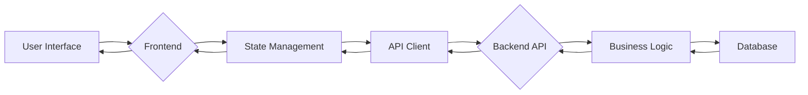

# TelePharmacy Application Components

## Frontend Components

### Main Components
1. **App** - Root component that manages overall state and routing
2. **Header** - Navigation bar with logo and menu
3. **Dashboard** - Overview of key metrics and statistics
4. **PatientList** - Displays list of patients
5. **PrescriptionList** - Displays list of prescriptions
6. **ConsultationList** - Displays list of consultations
7. **Footer** - Copyright and additional links

### UI Components
1. **PatientCard** - Individual patient display component
2. **PrescriptionCard** - Individual prescription display component
3. **ConsultationCard** - Individual consultation display component
4. **StatCard** - Dashboard statistics display component
5. **Button** - Reusable button component
6. **Tabs** - Tab navigation component

## Backend Components

### Controllers
1. **PatientController** - Manages patient-related operations
2. **PharmacistController** - Manages pharmacist-related operations
3. **PrescriptionController** - Manages prescription-related operations
4. **MedicationController** - Manages medication-related operations
5. **ConsultationController** - Manages consultation-related operations

### Services
1. **PatientService** - Business logic for patient management
2. **PharmacistService** - Business logic for pharmacist management
3. **PrescriptionService** - Business logic for prescription management
4. **MedicationService** - Business logic for medication management
5. **ConsultationService** - Business logic for consultation management

### Models
1. **Patient** - Patient data model
2. **Pharmacist** - Pharmacist data model
3. **Prescription** - Prescription data model
4. **Medication** - Medication data model
5. **Consultation** - Consultation data model

### Utilities
1. **Database** - Database connection and operations
2. **Authentication** - User authentication and authorization
3. **Validation** - Data validation utilities
4. **Logging** - Application logging utilities
5. **ErrorHandling** - Centralized error handling

## Data Flow Diagram

## Component Interaction

### Patient Registration Flow
1. User fills registration form in frontend
2. Frontend sends data to PatientController
3. PatientController validates data
4. PatientService creates new patient record
5. Database stores patient information
6. Response sent back to frontend
7. Frontend updates UI with success message

### Prescription Creation Flow
1. Pharmacist fills prescription form in frontend
2. Frontend sends data to PrescriptionController
3. PrescriptionController validates data
4. PrescriptionService creates new prescription
5. Database stores prescription information
6. Response sent back to frontend
7. Frontend updates UI with new prescription

### Consultation Scheduling Flow
1. Patient requests consultation in frontend
2. Frontend sends data to ConsultationController
3. ConsultationController validates availability
4. ConsultationService schedules new consultation
5. Database stores consultation information
6. Email notification sent to patient and pharmacist
7. Response sent back to frontend
8. Frontend updates UI with confirmation